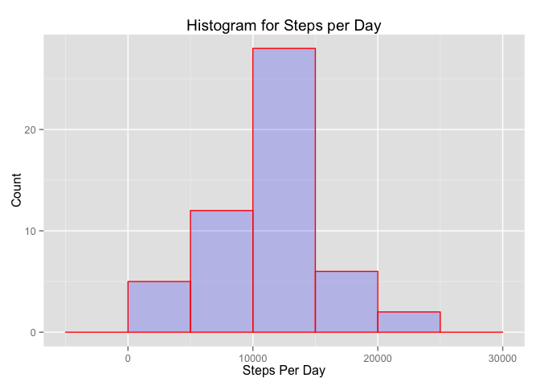
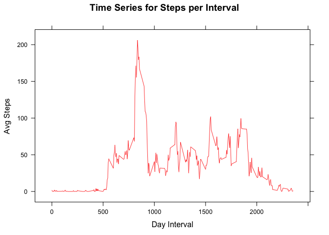
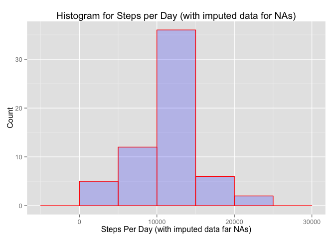
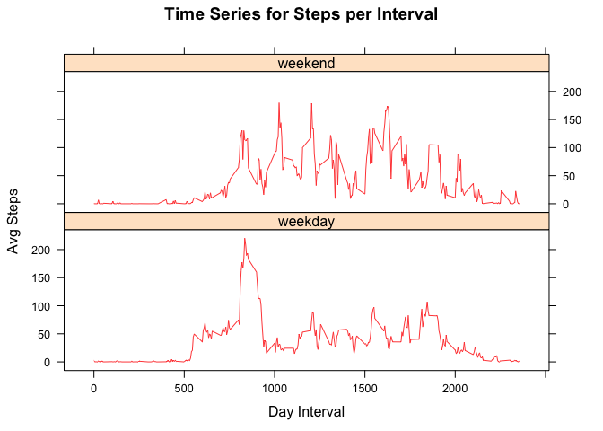

# Reproducible Research: Peer Assessment 1
Sohail Munir Khan  
15 July 2015  


## Loading and preprocessing the data

```r
zipfile <- "activity.zip"

# Check that zip file has been unzipped by looking of activtiy file
activityFile <- "activity.csv"

# If file doesn't exist, then unzip data
if (!file.exists(activityFile)) {
    print("Unzipping Activity Data")
    unzip(zipfile)
} else print("Activity Data already unzipped")
```

```
## [1] "Activity Data already unzipped"
```

```r
# Install "readr" package if required.
readrPackage <- "readr"
if (!readrPackage %in% installed.packages()[,"Package"])
    install.packages(readrPackage, 
                     repos="http://cran.rstudio.com/")

# Load "readr" package needed to group data to summarize
library(readr, warn.conflicts = FALSE)

## Read activites into R object specifying col types
# i for col_integer()
# D for col_date()
raw_activities <- read_csv(activityFile, col_types = "iDi")

# Omit any rows with "NA"s
activities <- na.omit(raw_activities)
```


## What is mean total number of steps taken per day?

```r
# Install "dplyr" package if required.
dplyrPackage <- "dplyr"
if (!dplyrPackage %in% installed.packages()[,"Package"])
    install.packages(dplyrPackage, 
                     repos="http://cran.rstudio.com/")

# Load "dplyr" package needed to group data to summarize
library(dplyr, warn.conflicts = FALSE)

#Chain together commands to:
# a) group activities by date
# b) summarise by date and calculate the sum of steps
# Output (day_summary): 
#    data frame with variables date, steps_per_day
day_summary <- activities %>% group_by(date) %>% summarise(steps_per_day = sum(steps))

# Show all days' summary
day_summary %>% as.data.frame()
```

```
##          date steps_per_day
## 1  2012-10-02           126
## 2  2012-10-03         11352
## 3  2012-10-04         12116
## 4  2012-10-05         13294
## 5  2012-10-06         15420
## 6  2012-10-07         11015
## 7  2012-10-09         12811
## 8  2012-10-10          9900
## 9  2012-10-11         10304
## 10 2012-10-12         17382
## 11 2012-10-13         12426
## 12 2012-10-14         15098
## 13 2012-10-15         10139
## 14 2012-10-16         15084
## 15 2012-10-17         13452
## 16 2012-10-18         10056
## 17 2012-10-19         11829
## 18 2012-10-20         10395
## 19 2012-10-21          8821
## 20 2012-10-22         13460
## 21 2012-10-23          8918
## 22 2012-10-24          8355
## 23 2012-10-25          2492
## 24 2012-10-26          6778
## 25 2012-10-27         10119
## 26 2012-10-28         11458
## 27 2012-10-29          5018
## 28 2012-10-30          9819
## 29 2012-10-31         15414
## 30 2012-11-02         10600
## 31 2012-11-03         10571
## 32 2012-11-05         10439
## 33 2012-11-06          8334
## 34 2012-11-07         12883
## 35 2012-11-08          3219
## 36 2012-11-11         12608
## 37 2012-11-12         10765
## 38 2012-11-13          7336
## 39 2012-11-15            41
## 40 2012-11-16          5441
## 41 2012-11-17         14339
## 42 2012-11-18         15110
## 43 2012-11-19          8841
## 44 2012-11-20          4472
## 45 2012-11-21         12787
## 46 2012-11-22         20427
## 47 2012-11-23         21194
## 48 2012-11-24         14478
## 49 2012-11-25         11834
## 50 2012-11-26         11162
## 51 2012-11-27         13646
## 52 2012-11-28         10183
## 53 2012-11-29          7047
```

[http://www.forbes.com/sites/naomirobbins/2012/01/04/a-histogram-is-not-a-bar-chart/]  
Histograms are used to show distributions of variables while bar charts are used to compare variables. Histograms plot quantitative data with ranges of the data grouped into bins or intervals while bar charts plot categorical data


```r
# Install "ggplot2" package if required.
ggplot2Package <- "ggplot2"
if (!ggplot2Package %in% installed.packages()[,"Package"])
    install.packages(ggplot2Package, 
                     repos="http://cran.rstudio.com/")

# Load "ggplot2" package needed to group data to summarize
library(ggplot2, warn.conflicts = FALSE)

# Create histogram using day_summary
qplot(steps_per_day, data = day_summary, geom = "histogram", binwidth = 5000, main = "Histogram for Steps per Day", xlab = "Steps Per Day", ylab = "Count", fill = I("blue"), col = I("red"), alpha = I(.2))
```

 

```r
# Get the summary to see Mean, Median, other info.
summary(day_summary$steps_per_day)
```

```
##    Min. 1st Qu.  Median    Mean 3rd Qu.    Max. 
##      41    8841   10760   10770   13290   21190
```


## What is the average daily activity pattern?

```r
# Install "lattice" package if required.
latticePackage <- "lattice"
if (!latticePackage %in% installed.packages()[,"Package"])
    install.packages(latticePackage, 
                     repos="http://cran.rstudio.com/")

# Load "ggplot2" package needed to group data to summarize
library(lattice, warn.conflicts = FALSE)

# Using raw_activities, group by interval and get a summary 
# of avg_steps per interval (ignoring NAs)
interval_summary <- raw_activities %>% group_by(interval) %>% summarise(avg_steps_per_interval = mean(steps, na.rm = TRUE))

# Create type = "l" (Time Series graph) using lattice xyplot
xyplot(avg_steps_per_interval ~ interval, data = interval_summary, type = "l", main = "Time Series for Steps per Interval", xlab = "Day Interval", ylab = "Avg Steps", col = I("red"), alpha = I(.8))
```

 

```r
# Arrange in decreasing order by avg_steps_per_interval
top_avg_steps_per_interval <- interval_summary %>% arrange(desc(avg_steps_per_interval))

# Show the highest interval and its avg_steps_per_interval
top_n(top_avg_steps_per_interval, 1)
```

```
## Selecting by avg_steps_per_interval
```

```
## Source: local data frame [1 x 2]
## 
##   interval avg_steps_per_interval
## 1      835               206.1698
```


## Imputing missing values

```r
# Sum all observations that have no missing values
sum(!complete.cases(raw_activities))
```

```
## [1] 2304
```

* Strategy: Fill with mean of that 5-minute interval


```r
# Create imputed_activities using raw_activities but all NAs filled up by first grouping by interval and using the mean of interval to fill when steps is NA
imputed_activities <- raw_activities %>% group_by(interval) %>% mutate(steps = ifelse(is.na(steps), mean(steps, na.rm = TRUE), steps))

# I am showing the first 10 rows of raw_activities, imputed_activities, interval_summary (we filled the same values) to confirm that we filled the correct values
raw_activities
```

```
## Source: local data frame [17,568 x 3]
## 
##    steps       date interval
## 1     NA 2012-10-01        0
## 2     NA 2012-10-01        5
## 3     NA 2012-10-01       10
## 4     NA 2012-10-01       15
## 5     NA 2012-10-01       20
## 6     NA 2012-10-01       25
## 7     NA 2012-10-01       30
## 8     NA 2012-10-01       35
## 9     NA 2012-10-01       40
## 10    NA 2012-10-01       45
## ..   ...        ...      ...
```

```r
imputed_activities
```

```
## Source: local data frame [17,568 x 3]
## Groups: interval
## 
##        steps       date interval
## 1  1.7169811 2012-10-01        0
## 2  0.3396226 2012-10-01        5
## 3  0.1320755 2012-10-01       10
## 4  0.1509434 2012-10-01       15
## 5  0.0754717 2012-10-01       20
## 6  2.0943396 2012-10-01       25
## 7  0.5283019 2012-10-01       30
## 8  0.8679245 2012-10-01       35
## 9  0.0000000 2012-10-01       40
## 10 1.4716981 2012-10-01       45
## ..       ...        ...      ...
```

```r
interval_summary
```

```
## Source: local data frame [288 x 2]
## 
##    interval avg_steps_per_interval
## 1         0              1.7169811
## 2         5              0.3396226
## 3        10              0.1320755
## 4        15              0.1509434
## 5        20              0.0754717
## 6        25              2.0943396
## 7        30              0.5283019
## 8        35              0.8679245
## 9        40              0.0000000
## 10       45              1.4716981
## ..      ...                    ...
```

```r
# Providing summaries to prove that NAs have been removed
summary(raw_activities)
```

```
##      steps             date               interval     
##  Min.   :  0.00   Min.   :2012-10-01   Min.   :   0.0  
##  1st Qu.:  0.00   1st Qu.:2012-10-16   1st Qu.: 588.8  
##  Median :  0.00   Median :2012-10-31   Median :1177.5  
##  Mean   : 37.38   Mean   :2012-10-31   Mean   :1177.5  
##  3rd Qu.: 12.00   3rd Qu.:2012-11-15   3rd Qu.:1766.2  
##  Max.   :806.00   Max.   :2012-11-30   Max.   :2355.0  
##  NA's   :2304
```

```r
summary(imputed_activities)
```

```
##      steps             date               interval     
##  Min.   :  0.00   Min.   :2012-10-01   Min.   :   0.0  
##  1st Qu.:  0.00   1st Qu.:2012-10-16   1st Qu.: 588.8  
##  Median :  0.00   Median :2012-10-31   Median :1177.5  
##  Mean   : 37.38   Mean   :2012-10-31   Mean   :1177.5  
##  3rd Qu.: 27.00   3rd Qu.:2012-11-15   3rd Qu.:1766.2  
##  Max.   :806.00   Max.   :2012-11-30   Max.   :2355.0
```

```r
# Create an imputed_day_summary to compare with day_summary (raw_activities)
imputed_day_summary <- imputed_activities %>% group_by(date) %>% summarise(steps_per_day = sum(steps))

# Create histogram using imputed_day_summary
qplot(steps_per_day, data = imputed_day_summary, geom = "histogram", binwidth = 5000, main = "Histogram for Steps per Day (with imputed data for NAs)", xlab = "Steps Per Day (with imputed data far NAs)", ylab = "Count", fill = I("blue"), col = I("red"), alpha = I(.2))
```

 

```r
# Get the summary to see Mean, Median for imputed data
summary(imputed_day_summary$steps_per_day)
```

```
##    Min. 1st Qu.  Median    Mean 3rd Qu.    Max. 
##      41    9819   10770   10770   12810   21190
```

```r
# Get the summary to see Mean, Median for raw data to compare
summary(day_summary$steps_per_day)
```

```
##    Min. 1st Qu.  Median    Mean 3rd Qu.    Max. 
##      41    8841   10760   10770   13290   21190
```

```r
# Showing all imputed_data_summary to show some of the changes to total daily number of steps
imputed_day_summary %>% as.data.frame()
```

```
##          date steps_per_day
## 1  2012-10-01      10766.19
## 2  2012-10-02        126.00
## 3  2012-10-03      11352.00
## 4  2012-10-04      12116.00
## 5  2012-10-05      13294.00
## 6  2012-10-06      15420.00
## 7  2012-10-07      11015.00
## 8  2012-10-08      10766.19
## 9  2012-10-09      12811.00
## 10 2012-10-10       9900.00
## 11 2012-10-11      10304.00
## 12 2012-10-12      17382.00
## 13 2012-10-13      12426.00
## 14 2012-10-14      15098.00
## 15 2012-10-15      10139.00
## 16 2012-10-16      15084.00
## 17 2012-10-17      13452.00
## 18 2012-10-18      10056.00
## 19 2012-10-19      11829.00
## 20 2012-10-20      10395.00
## 21 2012-10-21       8821.00
## 22 2012-10-22      13460.00
## 23 2012-10-23       8918.00
## 24 2012-10-24       8355.00
## 25 2012-10-25       2492.00
## 26 2012-10-26       6778.00
## 27 2012-10-27      10119.00
## 28 2012-10-28      11458.00
## 29 2012-10-29       5018.00
## 30 2012-10-30       9819.00
## 31 2012-10-31      15414.00
## 32 2012-11-01      10766.19
## 33 2012-11-02      10600.00
## 34 2012-11-03      10571.00
## 35 2012-11-04      10766.19
## 36 2012-11-05      10439.00
## 37 2012-11-06       8334.00
## 38 2012-11-07      12883.00
## 39 2012-11-08       3219.00
## 40 2012-11-09      10766.19
## 41 2012-11-10      10766.19
## 42 2012-11-11      12608.00
## 43 2012-11-12      10765.00
## 44 2012-11-13       7336.00
## 45 2012-11-14      10766.19
## 46 2012-11-15         41.00
## 47 2012-11-16       5441.00
## 48 2012-11-17      14339.00
## 49 2012-11-18      15110.00
## 50 2012-11-19       8841.00
## 51 2012-11-20       4472.00
## 52 2012-11-21      12787.00
## 53 2012-11-22      20427.00
## 54 2012-11-23      21194.00
## 55 2012-11-24      14478.00
## 56 2012-11-25      11834.00
## 57 2012-11-26      11162.00
## 58 2012-11-27      13646.00
## 59 2012-11-28      10183.00
## 60 2012-11-29       7047.00
## 61 2012-11-30      10766.19
```
Values differ in:  
* Mean: No change  
* Median: Imputed one has a slightly higher median  
* Total Daily Steps: For the days where we didn't have any data, they have been added with average number of steps based on interval

## Are there differences in activity patterns between weekdays and weekends?

```r
# Create a new factor variable day_type that is "weekday" for Saturday,Sunday and "weekend" otherwise
imputed_activities$day_type <- factor(ifelse(weekdays(imputed_activities$date) %in% c("Satuday", "Sunday"), "weekend", "weekday"))

# Using raw_activities, group by interval and get a summary 
# of avg_steps per interval (ignoring NAs)
imputed_interval_summary <- imputed_activities %>% group_by(interval, day_type) %>% summarise(avg_steps_per_interval = mean(steps, na.rm = TRUE))

xyplot(avg_steps_per_interval ~ interval | day_type, data = imputed_interval_summary, layout = c(1,2), type = "l", main = "Time Series for Steps per Interval", xlab = "Day Interval", ylab = "Avg Steps", col = I("red"), alpha = I(.8))
```

 
